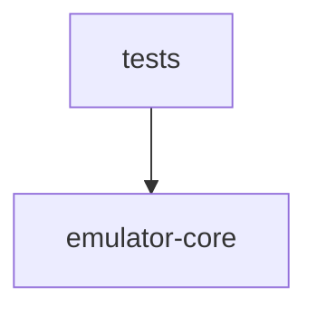

# Architecture Overview

Authoritative boundary record for this NES emulator. Every tracked file under
the declared source roots belongs to exactly one subsystem below.

## Source Roots

- `src/`

## Subsystems

1. **emulator-core** — CPU, addressing modes, system memory helpers, iNES ROM
   loader, and PPU skeleton that together form the console core. See
   [`sub-systems/emulator-core.md`](./sub-systems/emulator-core.md).
2. **tests** — Unit tests and redistributable fixtures (nestest). See
   [`sub-systems/tests.md`](./sub-systems/tests.md).

## Dependency Graph

Edges mean "may import from". `tests` exercises `emulator-core`. Core modules
do not import from tests.

## Source File Catalog (One-to-One Subsystem Mapping)

Every tracked file under `src/` appears here exactly once.

### emulator-core

- `src/.gitignore`
- `src/__init__.py`
- `src/addressing.py`
- `src/cpu.py`
- `src/memory.py`
- `src/nestest.log.txt`
- `src/ppu.py`
- `src/rom.py`

### tests

- `src/tests/__init__.py`
- `src/tests/testROMs/nestest.nes`
- `src/tests/test_cpu.py`
- `src/tests/test_rom.py`
